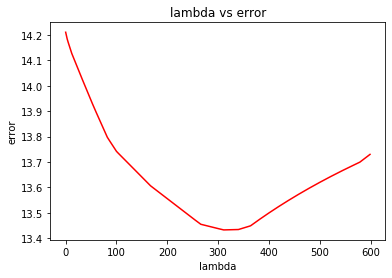
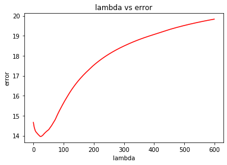

# House-Price-Prediction
Utilizing regression analysis on a raw dataset, to accurately predicts house prices, empowering users with invaluable insights for informed real estate decisions.

About:
======

House Price Prediction using Regression is a sophisticated technique that involves analyzing various factors such as location, square footage, number of bedrooms, and other relevant features to estimate the value of a property. By utilizing advanced statistical models, this approach helps individuals and professionals forecast and understand the potential prices of houses in a specific market, enabling them to make informed decisions when buying or selling real estate.

Steps to run the File:
======

Step 1:  Download the files and upload the .ipynb and the .csv file using either Google Colab or Jupyter Notebook.

Step 2:  Once uploaded, for Google Colab run every cell starting from the first one to reach the output or click on "Run All" cells.
         For Jupyter notebook, install the required libraries in your Windows/MAC/Linux devices to run the code.
         
         The required libraries for this project are :
         
         1.  Numpy:  https://numpy.org
         2.  Pandas: https://pandas.pydata.org
         3.  Matplotlib: https://matplotlib.org
         
         Install the required libraries as given in the above links and then after installtion start the procedure to run the cells from the "import" statements and similarly run all the required cells for execution.
         
Step 3:  Analyse the graph and the dataset along with the expected and predicted values calculated for the specific entry in the .csv file.

